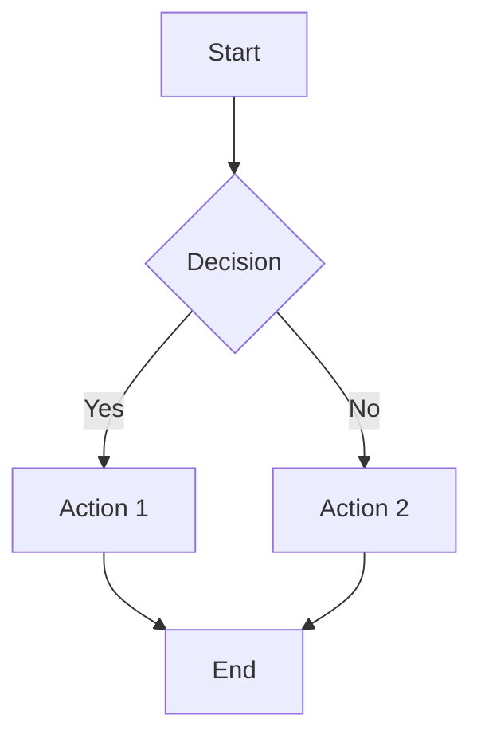

# Contributing to DevOps Documentation

Thank you for your interest in contributing to our DevOps documentation! This guide will help you get started with adding, editing, and maintaining content.

## 🚀 Quick Start for Contributors

### 1. Set Up Your Environment

```bash
# Fork and clone the repository
git clone https://github.com/arguxx/devops-docs.git
cd devops-docs

# Set up Python environment
python3 -m venv .venv
source .venv/bin/activate  # Windows: .venv\Scripts\activate

# Install dependencies
pip install -r requirements.txt

# Start development server
mkdocs serve
```

### 2. Make Your Changes

1. Create a new branch: `git checkout -b feature/your-feature-name`
2. Edit or add documentation files in the `docs/` directory
3. Preview your changes at http://127.0.0.1:8000
4. Test the build: `mkdocs build`

### 3. Submit Your Contribution

```bash
git add .
git commit -m "Add guide for XYZ tool"
git push origin feature/your-feature-name
```

Then open a Pull Request on GitHub.

## 📝 Content Guidelines

### Writing Style

-   **Clear and Concise**: Write in simple, direct language
-   **Actionable**: Include step-by-step instructions
-   **Consistent**: Follow the established tone and format
-   **Beginner-Friendly**: Explain technical terms and concepts
-   **Up-to-Date**: Ensure examples and instructions are current

### Content Structure

#### Page Structure

```markdown
# Page Title

Brief introduction explaining what this page covers.

## Section 1

Content with examples...

## Section 2

More content...

## Troubleshooting (optional)

Common issues and solutions...
```

#### Code Examples

Always include:

-   **Context**: What the code does
-   **Complete examples**: Not just snippets
-   **Comments**: Explain complex parts
-   **Testing**: How to verify it works

```bash title="Example with title"
# This command starts the application
docker run -d -p 8080:80 myapp:latest

# Verify it's running
curl http://localhost:8080/health
```

#### Use Admonitions for Important Information

```markdown
!!! tip "Pro Tip"
Use this format for helpful tips and best practices.

!!! warning "Important"
Use this for important warnings or prerequisites.

!!! bug "Known Issue"
Document known problems and workarounds.

!!! example "Example"
Use this for extended examples or case studies.
```

### File Organization

```
docs/
├── index.md                 # Homepage
├── getting-started/         # Beginner guides
│   ├── quick-start.md
│   └── installation.md
├── guides/                  # Detailed guides
│   ├── cicd.md
│   ├── iac.md
│   └── monitoring.md
├── tools/                   # Tool-specific docs
│   ├── docker.md
│   ├── kubernetes.md
│   └── terraform.md
├── best-practices.md        # Best practices
├── troubleshooting.md       # Common issues
└── stylesheets/
    └── extra.css
```

## 🎯 Content Types

### 1. Getting Started Guides

-   **Purpose**: Help new users get up and running quickly
-   **Format**: Step-by-step tutorials
-   **Audience**: Beginners
-   **Length**: 5-15 minutes to complete

### 2. Detailed Guides

-   **Purpose**: In-depth explanations of processes and workflows
-   **Format**: Comprehensive how-to guides
-   **Audience**: Intermediate to advanced users
-   **Length**: 15-45 minutes to read

### 3. Tool Documentation

-   **Purpose**: Reference material for specific tools
-   **Format**: Command reference, configuration examples
-   **Audience**: All levels
-   **Length**: Variable, often referenced

### 4. Best Practices

-   **Purpose**: Recommended approaches and patterns
-   **Format**: Guidelines with examples
-   **Audience**: All levels
-   **Length**: 10-20 minutes to read

### 5. Troubleshooting

-   **Purpose**: Solutions to common problems
-   **Format**: Problem/symptom → solution
-   **Audience**: All levels
-   **Length**: Quick reference

## 🔧 Technical Guidelines

### Markdown Formatting

#### Headers

```markdown
# Page Title (H1 - only one per page)

## Main Section (H2)

### Subsection (H3)

#### Details (H4)
```

#### Code Blocks

````markdown
# Inline code

Use `kubectl get pods` to list pods.

# Code blocks with language

```bash
docker ps
```
````

# Code blocks with title

```yaml title="config.yml"
version: "3.8"
services:
    web:
        image: nginx
```

````

#### Links
```markdown
# Internal links
[Getting Started](getting-started/quick-start.md)

# External links
[Docker Documentation](https://docs.docker.com/)

# Link with title
[MkDocs](https://mkdocs.org "Static Site Generator")
````

#### Tables

```markdown
| Tool       | Purpose          | Complexity |
| ---------- | ---------------- | ---------- |
| Docker     | Containerization | Medium     |
| Kubernetes | Orchestration    | High       |
```

#### Lists

```markdown
# Ordered list

1. First step
2. Second step
3. Third step

# Unordered list

-   Item one
-   Item two
-   Item three

# Task list

-   [x] Completed task
-   [ ] Pending task
```

### Navigation

Add new pages to `mkdocs.yml`:

```yaml
nav:
    - Home: index.md
    - Getting Started:
          - Quick Start: getting-started/quick-start.md
          - New Guide: getting-started/new-guide.md # Add here
    - Tools:
          - Docker: tools/docker.md
          - New Tool: tools/new-tool.md # Add here
```

### Images and Diagrams

#### Images

```markdown


# With title


```

#### Mermaid Diagrams

````markdown

````

````

## ✅ Review Process

### Before Submitting

- [ ] **Content Review**
  - Information is accurate and up-to-date
  - Examples work as written
  - Links are valid and functional
  - Spelling and grammar are correct

- [ ] **Technical Review**
  - Code examples are tested
  - Commands produce expected results
  - Screenshots are current (if included)
  - No sensitive information is exposed

- [ ] **Format Review**
  - Follows markdown conventions
  - Uses consistent formatting
  - Admonitions are used appropriately
  - Navigation is updated (if needed)

### Pull Request Checklist

```markdown
## Changes Made
- [ ] Added new guide for [tool/process]
- [ ] Updated existing documentation
- [ ] Fixed broken links/examples
- [ ] Improved formatting/clarity

## Testing
- [ ] Local build successful (`mkdocs build`)
- [ ] All examples tested and working
- [ ] Links verified
- [ ] Spelling/grammar checked

## Documentation
- [ ] Updated navigation in mkdocs.yml
- [ ] Added to relevant cross-references
- [ ] Updated README if needed
````

### Review Criteria

Reviewers will check for:

1. **Accuracy**: Information is correct and current
2. **Clarity**: Content is easy to understand
3. **Completeness**: All necessary information is included
4. **Consistency**: Follows established patterns and style
5. **Functionality**: Examples and instructions work as described

## 🐛 Reporting Issues

Found a problem? Please report it!

### Bug Reports

```markdown
**Page**: Link to the problematic page
**Issue**: Description of the problem
**Expected**: What should happen
**Actual**: What actually happens
**Environment**: Browser, OS, etc. (if relevant)
```

### Content Requests

```markdown
**Topic**: What needs documentation
**Audience**: Who would use this (beginners/advanced)
**Priority**: How urgent is this need
**Context**: Why is this needed
```

### Improvement Suggestions

```markdown
**Page**: Link to the page
**Current**: How it works now
**Proposed**: Suggested improvement
**Benefit**: Why this would be better
```

## 📋 Content Templates

### New Tool Guide Template

````markdown
# Tool Name

Brief description of what the tool does and why it's useful in DevOps.

## Installation

### Prerequisites

-   Requirement 1
-   Requirement 2

### Installation Steps

=== "macOS"
`bash
    brew install tool-name
    `

=== "Linux"
`bash
    sudo apt install tool-name
    `

=== "Windows"
`powershell
    choco install tool-name
    `

## Basic Usage

### Getting Started

```bash
# Basic command
tool-name --help
```
````

### Common Commands

| Command        | Description  | Example                  |
| -------------- | ------------ | ------------------------ |
| `tool command` | What it does | `tool start --port 8080` |

## Configuration

### Basic Configuration

```yaml title="config.yml"
# Example configuration
setting: value
```

### Advanced Configuration

More complex setup...

## Best Practices

-   Best practice 1
-   Best practice 2
-   Best practice 3

## Troubleshooting

### Common Issues

!!! bug "Issue Name"
**Symptoms**: What you see
**Cause**: Why it happens
**Solution**: How to fix it

## Further Reading

-   [Official Documentation](https://tool-website.com)
-   [Community Resources](https://community.tool.com)

````

### Process Guide Template

```markdown
# Process Name

What this process accomplishes and when to use it.

## Overview

### Prerequisites
- What you need before starting
- Skills/knowledge required
- Tools that must be installed

### Time Required
Approximately X minutes/hours

## Step-by-Step Guide

### Step 1: Preparation
```bash
# Commands or setup needed
````

### Step 2: Implementation

Detailed instructions...

### Step 3: Verification

How to confirm it worked...

## Variations

### Alternative Approach 1

When to use this variation...

### Alternative Approach 2

When to use this variation...

## Best Practices

Important considerations and recommendations...

## Troubleshooting

Common problems and solutions...

## Next Steps

What to do after completing this process...

```

## 🎉 Getting Recognized

### Contributor Benefits

- **Recognition**: Contributors listed in README
- **Learning**: Gain experience with modern documentation tools
- **Impact**: Help improve DevOps practices across teams
- **Community**: Connect with other DevOps practitioners

### Contribution Types

All contributions are valuable:

- **Content**: Writing new guides and tutorials
- **Editing**: Improving existing content
- **Review**: Helping review pull requests
- **Issues**: Reporting bugs and suggesting improvements
- **Design**: Improving site layout and user experience

## 📞 Getting Help

### Questions About Contributing

- **GitHub Issues**: Ask questions about the project
- **Discussions**: Join the community conversation
- **Email**: Contact maintainers for sensitive topics

### Questions About Content

- **Subject Matter**: Ask the relevant team experts
- **Technical Writing**: Contact documentation team
- **Tool Specifics**: Consult tool documentation and communities

---

**Thank you for contributing to our DevOps documentation!** Every contribution, no matter how small, helps our community learn and grow. 🚀
```
