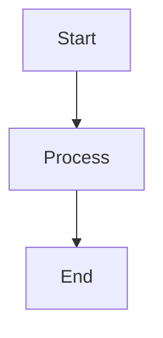

# DevOps Documentation Hub

[](https://opensource.org/licenses/MIT)
[](https://arguxx.github.io/devops-docs/)

A comprehensive, open-source documentation website for DevOps practices, tools, and workflows built with MkDocs Material.

## 🚀 Quick Start

### Prerequisites

-   Python 3.8+
-   Git

### Local Development

1. **Clone the repository:**

    ```bash
    git clone https://github.com/arguxx/devops-docs.git
    cd devops-docs
    ```

2. **Set up Python environment:**

    ```bash
    python3 -m venv .venv
    source .venv/bin/activate  # On Windows: .venv\Scripts\activate
    ```

3. **Install dependencies:**

    ```bash
    pip install -r requirements.txt
    ```

4. **Start the development server:**

    ```bash
    mkdocs serve
    ```

5. **Open your browser:** http://127.0.0.1:8000

## 📁 Project Structure

```
documentation/
├── docs/                    # Documentation content
│   ├── index.md            # Homepage
│   ├── getting-started/    # Getting started guides
│   ├── guides/             # DevOps guides
│   ├── tools/              # Tool-specific documentation
│   └── stylesheets/        # Custom CSS
├── mkdocs.yml              # MkDocs configuration
├── requirements.txt        # Python dependencies
└── README.md              # This file
```

## ✨ Features

-   **Modern Theme**: Material Design with dark/light mode
-   **Fast Search**: Built-in search functionality
-   **Code Highlighting**: Syntax highlighting for 100+ languages
-   **Responsive Design**: Mobile-friendly layout
-   **Mermaid Diagrams**: Support for flowcharts and diagrams
-   **Git Integration**: Last update timestamps
-   **Easy Navigation**: Tabbed navigation with breadcrumbs

## 📝 Adding Content

### Creating New Pages

1. Create a new Markdown file in the appropriate directory under `docs/`
2. Add the page to the navigation in `mkdocs.yml`:
    ```yaml
    nav:
        - Home: index.md
        - Your New Section:
              - Your Page: path/to/your-page.md
    ```

### Writing Content

Use standard Markdown with these enhancements:

#### Admonitions

```markdown
!!! tip "Pro Tip"
This is a helpful tip for users.

!!! warning "Important"
This is a warning message.

!!! bug "Known Issue"
This describes a known problem.
```

#### Code Blocks with Titles

````markdown
```bash title="setup.sh"
#!/bin/bash
echo "Setting up environment..."
```
````

#### Tabbed Content

```markdown
=== "macOS"
`bash
    brew install docker
    `

=== "Linux"
`bash
    sudo apt install docker.io
    `
```

#### Mermaid Diagrams

````markdown

````

### Best Practices

-   Use clear, descriptive headings
-   Include code examples where applicable
-   Add links to related sections
-   Keep content up-to-date
-   Use consistent formatting

## 🚀 Deployment

### GitHub Pages (Recommended)

1. **Push to GitHub:**

    ```bash
    git add .
    git commit -m "Initial documentation"
    git push origin main
    ```

2. **Enable GitHub Actions:** The included workflow will automatically deploy to GitHub Pages

3. **Configure Pages:** Go to repository Settings > Pages > Source: GitHub Actions

### Manual Build

```bash
# Build static site
mkdocs build

# Deploy to GitHub Pages
mkdocs gh-deploy
```

### Other Hosting Options

-   **Netlify**: Connect your GitHub repo for automatic deployments
-   **Vercel**: Import GitHub repository
-   **Azure Static Web Apps**: Deploy from GitHub Actions
-   **AWS S3 + CloudFront**: Use the built site/ directory

## 🛠️ Customization

### Theme Colors

Edit `mkdocs.yml` to change the color scheme:

```yaml
theme:
    palette:
        - scheme: default
          primary: blue # Change to your preferred color
          accent: light blue
```

### Custom CSS

Add custom styles to `docs/stylesheets/extra.css`.

### Adding Plugins

1. Install the plugin:

    ```bash
    pip install mkdocs-plugin-name
    ```

2. Add to `mkdocs.yml`:

    ```yaml
    plugins:
        - plugin-name
    ```

3. Update `requirements.txt`

## 🤝 Contributing

We welcome contributions! Please see [CONTRIBUTING.md](CONTRIBUTING.md) for guidelines.

### Quick Contribution Steps

1. Fork the repository
2. Create a feature branch: `git checkout -b feature/new-guide`
3. Make your changes
4. Test locally: `mkdocs serve`
5. Commit: `git commit -m "Add new deployment guide"`
6. Push: `git push origin feature/new-guide`
7. Open a Pull Request

## 📊 Analytics

To add analytics, update `mkdocs.yml`:

```yaml
extra:
    analytics:
        provider: google
        property: G-XXXXXXXXXX
```

## 🆘 Troubleshooting

### Common Issues

**Build Errors:**

-   Check that all links are valid
-   Ensure proper YAML formatting in `mkdocs.yml`
-   Verify all referenced files exist

**Styling Issues:**

-   Clear browser cache
-   Check `extra.css` for syntax errors
-   Verify Material theme version compatibility

**Deployment Failures:**

-   Check GitHub Actions logs
-   Ensure `GITHUB_TOKEN` has proper permissions
-   Verify `gh-pages` branch exists

### Getting Help

-   Check the [MkDocs documentation](https://www.mkdocs.org/)
-   Review [Material theme docs](https://squidfunk.github.io/mkdocs-material/)
-   Open an issue in this repository

## 📄 License

This project is licensed under the MIT License - see the [LICENSE](LICENSE) file for details.

### MIT License Summary

-   ✅ **Commercial use** - Use this project in commercial applications
-   ✅ **Modification** - Modify and adapt the code to your needs
-   ✅ **Distribution** - Share and distribute the project
-   ✅ **Private use** - Use privately without restrictions
-   ⚠️ **Attribution required** - Include copyright notice and license
-   ❌ **No warranty** - Project comes without any warranty

## 🙏 Acknowledgments

-   [MkDocs](https://www.mkdocs.org/) - Static site generator
-   [Material for MkDocs](https://squidfunk.github.io/mkdocs-material/) - Beautiful theme
-   [Python Markdown](https://python-markdown.github.io/) - Markdown processing

---

**Happy documenting!** 📚✨
