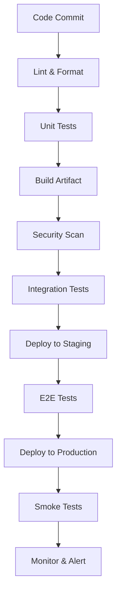
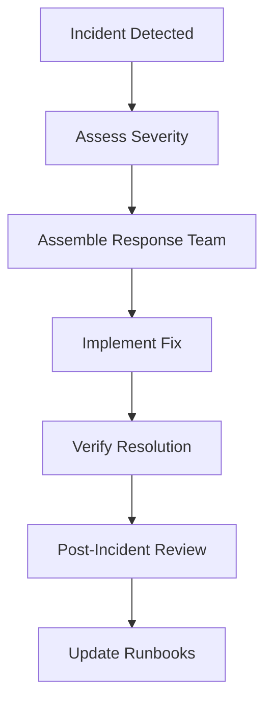

# Best Practices

Essential DevOps best practices for building reliable, scalable, and maintainable systems.

## 🏗️ Infrastructure as Code (IaC)

### Core Principles

!!! tip "Golden Rules" - **Version Control Everything** - Treat infrastructure like code - **Immutable Infrastructure** - Replace, don't modify - **Environment Parity** - Keep environments consistent - **Automated Testing** - Test infrastructure changes

### Implementation Guidelines

```hcl title="terraform/main.tf"
# Use consistent naming conventions
resource "aws_instance" "web_server" {
  ami           = var.ami_id
  instance_type = var.instance_type

  tags = {
    Name        = "${var.environment}-web-server"
    Environment = var.environment
    Project     = var.project_name
    Owner       = var.team_email
  }
}

# Always specify provider versions
terraform {
  required_version = ">= 1.0"
  required_providers {
    aws = {
      source  = "hashicorp/aws"
      version = "~> 5.0"
    }
  }
}
```

## 🔄 CI/CD Pipeline Design

### Pipeline Structure



### Quality Gates

| Stage           | Criteria                         | Action on Failure |
| --------------- | -------------------------------- | ----------------- |
| **Lint**        | Code style compliance            | Block merge       |
| **Unit Tests**  | >80% coverage, all pass          | Block merge       |
| **Security**    | No high/critical vulnerabilities | Block deployment  |
| **Integration** | All APIs functional              | Rollback          |

## 🛡️ Security Best Practices

### Secrets Management

```yaml title="GitHub Actions Example"
jobs:
    deploy:
        runs-on: ubuntu-latest
        steps:
            - name: Deploy to Kubernetes
              env:
                  KUBECONFIG: ${{ secrets.KUBECONFIG }}
                  DATABASE_PASSWORD: ${{ secrets.DB_PASSWORD }}
              run: |
                  # Never echo secrets
                  kubectl apply -f deployment.yaml
```

### Container Security

```dockerfile title="Secure Dockerfile"
# Use minimal base images
FROM alpine:3.18

# Create non-root user
RUN adduser -D -s /bin/sh appuser

# Install only necessary packages
RUN apk add --no-cache ca-certificates

# Copy files with proper ownership
COPY --chown=appuser:appuser app /app

# Switch to non-root user
USER appuser

# Use specific ports
EXPOSE 8080

# Health check
HEALTHCHECK --interval=30s --timeout=3s \
  CMD wget --no-verbose --tries=1 --spider http://localhost:8080/health || exit 1
```

## 📊 Monitoring & Observability

### The Three Pillars

=== "Metrics"
```yaml title="prometheus.yml"
rule_files: - "alert_rules.yml"

    scrape_configs:
      - job_name: 'application'
        static_configs:
          - targets: ['app:8080']
        metrics_path: /metrics
        scrape_interval: 15s
    ```

=== "Logs"
`json title="Structured Logging"
    {
      "timestamp": "2023-11-03T10:00:00Z",
      "level": "ERROR",
      "service": "user-service",
      "trace_id": "abc123",
      "message": "Database connection failed",
      "error": {
        "type": "ConnectionError",
        "details": "timeout after 30s"
      }
    }
    `

=== "Traces"
```python title="OpenTelemetry Example"
from opentelemetry import trace

    tracer = trace.get_tracer(__name__)

    @tracer.start_as_current_span("process_user_request")
    def process_user(user_id):
        span = trace.get_current_span()
        span.set_attribute("user.id", user_id)

        # Your business logic here
        return result
    ```

### Key Metrics to Track

| Category         | Metric        | Target | Alert Threshold |
| ---------------- | ------------- | ------ | --------------- |
| **Performance**  | Response Time | <200ms | >500ms          |
| **Availability** | Uptime        | 99.9%  | <99%            |
| **Errors**       | Error Rate    | <0.1%  | >1%             |
| **Capacity**     | CPU Usage     | <70%   | >85%            |

## 🚀 Deployment Strategies

### Progressive Deployment

```yaml title="Canary Deployment"
apiVersion: argoproj.io/v1alpha1
kind: Rollout
metadata:
    name: rollout-canary
spec:
    replicas: 10
    strategy:
        canary:
            steps:
                - setWeight: 10
                - pause: { duration: 1m }
                - setWeight: 50
                - pause: { duration: 2m }
                - setWeight: 100
    template:
        spec:
            containers:
                - name: app
                  image: myapp:v2
```

### Feature Flags

```javascript title="Feature Flag Implementation"
const featureFlags = {
    newCheckoutFlow: {
        enabled: process.env.NEW_CHECKOUT_ENABLED === "true",
        rollout: 25, // Percentage of users
    },
};

function isFeatureEnabled(flagName, userId) {
    const flag = featureFlags[flagName];
    if (!flag.enabled) return false;

    // Hash-based consistent rollout
    const hash = hashUserId(userId);
    return hash % 100 < flag.rollout;
}
```

## 🔧 Configuration Management

### Environment-Specific Configs

```yaml title="config/environments/production.yml"
database:
    host: ${DATABASE_HOST}
    port: ${DATABASE_PORT:5432}
    name: ${DATABASE_NAME}

logging:
    level: ${LOG_LEVEL:INFO}
    format: json

redis:
    url: ${REDIS_URL}
    pool_size: ${REDIS_POOL_SIZE:10}
```

### Configuration Validation

```python title="Config Validation"
from pydantic import BaseSettings, validator

class Settings(BaseSettings):
    database_url: str
    redis_url: str
    log_level: str = "INFO"

    @validator('log_level')
    def validate_log_level(cls, v):
        allowed = ['DEBUG', 'INFO', 'WARNING', 'ERROR']
        if v not in allowed:
            raise ValueError(f'log_level must be one of {allowed}')
        return v

    class Config:
        env_file = ".env"
```

## 📈 Performance Optimization

### Application Performance

```yaml title="Kubernetes Resource Limits"
resources:
    requests:
        memory: "128Mi"
        cpu: "100m"
    limits:
        memory: "256Mi"
        cpu: "200m"

# Horizontal Pod Autoscaler
apiVersion: autoscaling/v2
kind: HorizontalPodAutoscaler
metadata:
    name: app-hpa
spec:
    scaleTargetRef:
        apiVersion: apps/v1
        kind: Deployment
        name: app
    minReplicas: 2
    maxReplicas: 10
    metrics:
        - type: Resource
          resource:
              name: cpu
              target:
                  type: Utilization
                  averageUtilization: 70
```

### Database Optimization

```sql title="Database Best Practices"
-- Use proper indexing
CREATE INDEX CONCURRENTLY idx_users_email ON users(email);

-- Monitor slow queries
SELECT query, mean_time, calls
FROM pg_stat_statements
ORDER BY mean_time DESC
LIMIT 10;

-- Connection pooling
-- Use PgBouncer or similar for connection management
```

## 🔄 Backup & Disaster Recovery

### Backup Strategy

```bash title="Automated Backup Script"
#!/bin/bash
set -euo pipefail

BACKUP_DATE=$(date +%Y%m%d_%H%M%S)
BACKUP_DIR="/backups/${BACKUP_DATE}"

# Database backup
pg_dump "${DATABASE_URL}" | gzip > "${BACKUP_DIR}/database.sql.gz"

# File system backup
tar -czf "${BACKUP_DIR}/files.tar.gz" /app/uploads

# Upload to S3
aws s3 sync "${BACKUP_DIR}" "s3://backups/$(date +%Y/%m/%d)/"

# Cleanup old backups (keep 30 days)
find /backups -type d -mtime +30 -exec rm -rf {} +
```

### Recovery Testing

!!! warning "Regular Testing Required" - Test backups monthly - Document recovery procedures - Measure Recovery Time Objective (RTO) - Measure Recovery Point Objective (RPO)

## 🤝 Team Collaboration

### Code Review Guidelines

**Required Checks:**

-   [ ] Code follows style guidelines
-   [ ] Tests are included and passing
-   [ ] Documentation is updated
-   [ ] Security considerations addressed
-   [ ] Performance impact assessed

### Incident Response



## 📚 Documentation Standards

### Runbook Template

```markdown title="runbook-template.md"
# Service Name Runbook

## Service Overview

-   **Purpose**: What does this service do?
-   **Dependencies**: What does it depend on?
-   **SLA**: What are the availability requirements?

## Architecture

-   Deployment diagram
-   Data flow
-   Integration points

## Monitoring

-   Key metrics and dashboards
-   Alert conditions
-   Log locations

## Common Issues

-   Issue: Description
-   Symptoms: What you'll see
-   Resolution: Step-by-step fix
-   Prevention: How to avoid

## Emergency Contacts

-   Primary: On-call engineer
-   Secondary: Service owner
-   Escalation: Team lead
```

## 🎯 Continuous Improvement

### Metrics-Driven Decisions

| Metric               | Current | Target     | Actions             |
| -------------------- | ------- | ---------- | ------------------- |
| Deployment Frequency | Weekly  | Daily      | Automate more tests |
| Lead Time            | 5 days  | 2 days     | Reduce review time  |
| MTTR                 | 2 hours | 30 minutes | Better monitoring   |
| Change Failure Rate  | 15%     | <5%        | Improve testing     |

### Regular Reviews

-   **Weekly**: Team retrospectives
-   **Monthly**: Service health reviews
-   **Quarterly**: Architecture reviews
-   **Annually**: Technology stack evaluation

Remember: **Best practices evolve with your team and technology. Regularly reassess and adapt!**
