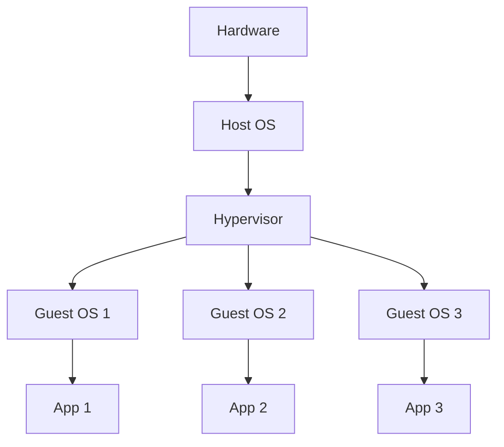
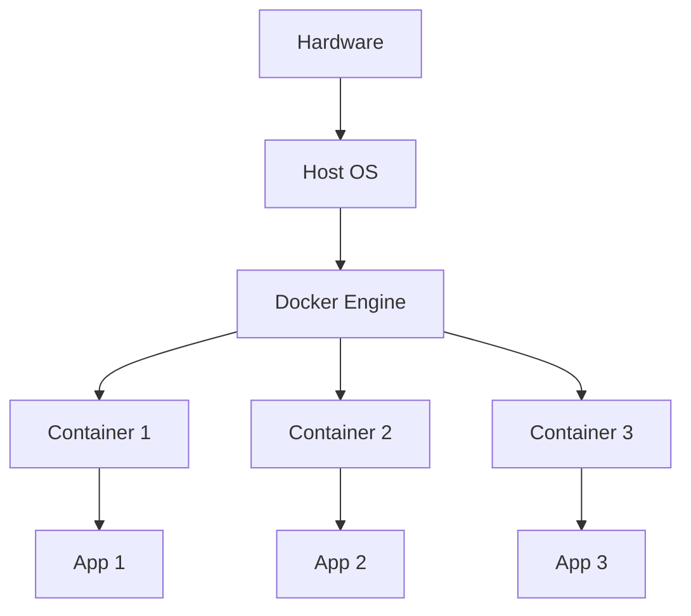
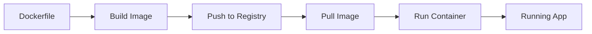
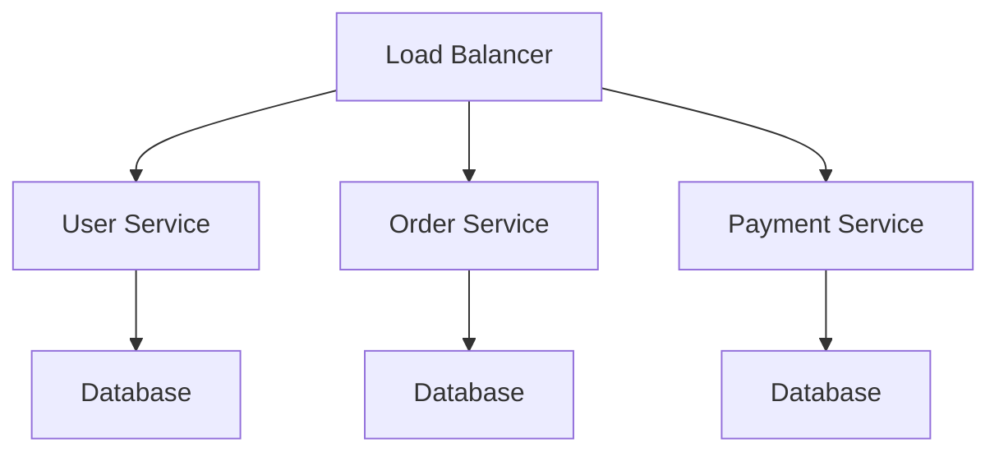

# 1.1 Apa itu Docker?

!!! quote "Definisi"
**Docker** adalah platform containerization yang memungkinkan developer untuk mengemas aplikasi beserta semua dependencies-nya ke dalam unit yang portabel dan ringan yang disebut **container**.

## 🤔 Mengapa Docker Penting?

Pernahkah Anda mengalami situasi seperti ini?

-   **"Di komputer saya bisa jalan!"** - Aplikasi berjalan di development tapi error di production
-   **Setup yang rumit** - Butuh waktu berjam-jam untuk setup environment baru
-   **Konflik dependencies** - Python versi berbeda, library yang bentrok
-   **Resource boros** - Virtual machine yang berat untuk aplikasi sederhana

Docker hadir untuk menyelesaikan masalah-masalah ini! 🚀

## 🏗️ Arsitektur Docker

### Sebelum Docker: Virtual Machines



**Masalah VM:**

-   Setiap VM butuh OS lengkap
-   Konsumsi resource tinggi
-   Boot time lambat
-   Overhead yang besar

### Dengan Docker: Containerization



**Keunggulan Docker:**

-   Share kernel OS host
-   Resource usage minimal
-   Start dalam hitungan detik
-   Isolation yang aman

## 📦 Konsep Dasar Docker

### 1. **Container**

Container adalah instance yang berjalan dari sebuah Docker image.

!!! example "Analogi"
Bayangkan container seperti **apartemen**:

    - Setiap apartemen punya ruang sendiri (isolated)
    - Share infrastruktur gedung (kernel)
    - Bisa pindah ke gedung lain (portabel)
    - Lebih efisien dari rumah terpisah (VM)

### 2. **Image**

Image adalah template read-only yang berisi instruksi untuk membuat container.

!!! example "Analogi"
Image seperti **blueprint apartemen**:

    - Berisi rancangan lengkap
    - Bisa digunakan berkali-kali
    - Tidak berubah (immutable)
    - Dasar untuk membangun container

### 3. **Dockerfile**

File teks yang berisi instruksi untuk membangun Docker image.

```dockerfile title="Contoh Dockerfile"
# Gunakan base image Python
FROM python:3.9-slim

# Set working directory
WORKDIR /app

# Copy requirements
COPY requirements.txt .

# Install dependencies
RUN pip install -r requirements.txt

# Copy aplikasi
COPY . .

# Ekspose port
EXPOSE 8000

# Jalankan aplikasi
CMD ["python", "app.py"]
```

### 4. **Docker Registry**

Tempat penyimpanan dan distribusi Docker images.

**Contoh Registry:**

-   **Docker Hub** - Registry publik terbesar
-   **GitHub Container Registry** - Terintegrasi dengan GitHub
-   **Amazon ECR** - Registry AWS
-   **Private Registry** - Registry internal perusahaan

## 🔄 Docker Workflow



### Step-by-Step:

1. **Write** - Tulis Dockerfile dengan instruksi
2. **Build** - Build image dari Dockerfile
3. **Push** - Upload image ke registry
4. **Pull** - Download image dari registry
5. **Run** - Jalankan container dari image

## 💡 Keunggulan Docker

### 🚀 **Portabilitas**

```bash
# Jalan di mana saja
docker run myapp
```

-   Sama di development, staging, production
-   Cross-platform: Linux, Windows, macOS
-   Cloud agnostic: AWS, Azure, GCP

### ⚡ **Efisiensi**

| Aspek            | Virtual Machine | Docker Container |
| ---------------- | --------------- | ---------------- |
| **Startup Time** | 1-2 menit       | 1-2 detik        |
| **Memory Usage** | GB              | MB               |
| **Disk Space**   | GB              | MB               |
| **Performance**  | Overhead tinggi | Near-native      |

### 🔄 **Konsistensi**

!!! success "Benefit" - Environment yang sama di semua stage - Eliminasi "works on my machine" syndrome - Dependency hell solved

### 📈 **Skalabilitas**

```bash
# Scale horizontal dengan mudah
docker run -d --name web1 myapp
docker run -d --name web2 myapp
docker run -d --name web3 myapp
```

## 🛠️ Use Cases Docker

### 1. **Microservices Architecture**



Setiap service berjalan di container terpisah.

### 2. **CI/CD Pipeline**

```yaml title=".github/workflows/deploy.yml"
- name: Build Docker Image
  run: docker build -t myapp:${{ github.sha }} .

- name: Push to Registry
  run: docker push myapp:${{ github.sha }}

- name: Deploy to Production
  run: docker run -d myapp:${{ github.sha }}
```

### 3. **Development Environment**

```bash
# Setup database untuk development
docker run -d --name postgres \
  -e POSTGRES_PASSWORD=secret \
  postgres:13

# Aplikasi langsung konek ke database
docker run --link postgres myapp
```

### 4. **Application Packaging**

Distribusi aplikasi jadi lebih mudah:

```bash
# User cukup jalankan satu command
docker run -p 8080:80 myapp
```

## 🎯 Docker vs Alternatif Lain

| Technology  | Isolation      | Performance | Startup | Use Case            |
| ----------- | -------------- | ----------- | ------- | ------------------- |
| **Docker**  | Process-level  | Excellent   | Seconds | Apps, Microservices |
| **VM**      | Hardware-level | Good        | Minutes | Legacy, Full OS     |
| **LXC/LXD** | OS-level       | Excellent   | Seconds | System Containers   |
| **Podman**  | Process-level  | Excellent   | Seconds | Rootless Containers |

## ✅ Checklist Pemahaman

Setelah membaca materi ini, Anda harus bisa menjawab:

-   [ ] Apa perbedaan utama container dan VM?
-   [ ] Apa itu Docker image dan container?
-   [ ] Mengapa Docker lebih efisien dari VM?
-   [ ] Apa fungsi Dockerfile?
-   [ ] Bagaimana workflow Docker secara umum?
-   [ ] Apa keunggulan utama Docker?

## 🎉 Rangkuman

!!! summary "Key Takeaways"
**Docker** adalah teknologi containerization yang memungkinkan:

    ✅ **Portabilitas** - Jalan di mana saja
    ✅ **Efisiensi** - Resource usage minimal
    ✅ **Konsistensi** - Environment yang sama
    ✅ **Skalabilitas** - Mudah di-scale
    ✅ **Isolasi** - Aplikasi terpisah aman

## 🚀 Langkah Selanjutnya

Sekarang Anda sudah memahami konsep dasar Docker! Waktunya untuk:

1. [**Setup dan Instalasi Docker →**](1.2-setup-dan-instalasi.md)
2. Practice dengan container pertama Anda
3. Explore Docker Hub untuk melihat image yang tersedia

---

!!! tip "Pro Tip"
Jangan hanya baca teori - langsung practice! Docker adalah skill yang harus dipraktekkan untuk benar-benar memahaminya. 💪

!!! info "Trivia"
Docker dibuat oleh Solomon Hykes di dotCloud (sekarang Docker Inc.) pada tahun 2013. Nama "Docker" berasal dari "dock worker" - pekerja yang memuat dan membongkar container di pelabuhan! 🚢
