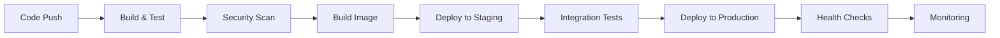
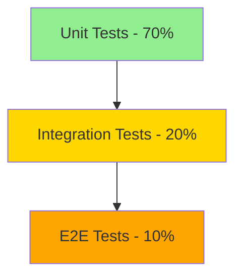

# CI/CD Pipelines

Learn how to set up and manage continuous integration and deployment pipelines.

## Overview

Our CI/CD strategy focuses on:

-   **Automated Testing** - Unit, integration, and end-to-end tests
-   **Security Scanning** - Vulnerability and compliance checks
-   **Containerization** - Docker builds and registry management
-   **Progressive Deployment** - Blue-green and canary deployments

## Pipeline Architecture



## GitHub Actions Workflow

### Basic Pipeline Structure

```yaml title=".github/workflows/ci-cd.yml"
name: CI/CD Pipeline

on:
    push:
        branches: [main, develop]
    pull_request:
        branches: [main]

env:
    REGISTRY: ghcr.io
    IMAGE_NAME: ${{ github.repository }}

jobs:
    test:
        runs-on: ubuntu-latest
        steps:
            - uses: actions/checkout@v3

            - name: Setup Node.js
              uses: actions/setup-node@v3
              with:
                  node-version: "18"
                  cache: "npm"

            - name: Install dependencies
              run: npm ci

            - name: Run tests
              run: npm test

            - name: Run linting
              run: npm run lint

    security:
        runs-on: ubuntu-latest
        needs: test
        steps:
            - uses: actions/checkout@v3

            - name: Run Trivy vulnerability scanner
              uses: aquasecurity/trivy-action@master
              with:
                  scan-type: "fs"
                  format: "sarif"
                  output: "trivy-results.sarif"

            - name: Upload Trivy scan results
              uses: github/codeql-action/upload-sarif@v2
              with:
                  sarif_file: "trivy-results.sarif"

    build:
        runs-on: ubuntu-latest
        needs: [test, security]
        if: github.ref == 'refs/heads/main'
        steps:
            - uses: actions/checkout@v3

            - name: Log in to Container Registry
              uses: docker/login-action@v2
              with:
                  registry: ${{ env.REGISTRY }}
                  username: ${{ github.actor }}
                  password: ${{ secrets.GITHUB_TOKEN }}

            - name: Build and push Docker image
              uses: docker/build-push-action@v4
              with:
                  context: .
                  push: true
                  tags: ${{ env.REGISTRY }}/${{ env.IMAGE_NAME }}:${{ github.sha }}
```

## Deployment Strategies

### 1. Blue-Green Deployment

```yaml title="Blue-Green Deployment"
deploy-blue-green:
    runs-on: ubuntu-latest
    needs: build
    steps:
        - name: Deploy to Blue Environment
          run: |
              kubectl set image deployment/app app=${{ env.REGISTRY }}/${{ env.IMAGE_NAME }}:${{ github.sha }} -n blue
              kubectl rollout status deployment/app -n blue

        - name: Run Health Checks
          run: ./scripts/health-check.sh blue

        - name: Switch Traffic to Blue
          run: |
              kubectl patch service app-service -p '{"spec":{"selector":{"version":"blue"}}}'

        - name: Cleanup Green Environment
          run: kubectl delete deployment app -n green
```

### 2. Canary Deployment

```yaml title="Canary Deployment"
deploy-canary:
    runs-on: ubuntu-latest
    needs: build
    steps:
        - name: Deploy Canary (10%)
          run: |
              kubectl set image deployment/app-canary app=${{ env.REGISTRY }}/${{ env.IMAGE_NAME }}:${{ github.sha }}
              kubectl scale deployment/app-canary --replicas=1

        - name: Monitor Metrics
          run: ./scripts/monitor-canary.sh

        - name: Promote to 100%
          if: success()
          run: |
              kubectl set image deployment/app-main app=${{ env.REGISTRY }}/${{ env.IMAGE_NAME }}:${{ github.sha }}
              kubectl scale deployment/app-canary --replicas=0
```

## Testing Strategy

### Test Pyramid



### Test Configuration

```javascript title="jest.config.js"
module.exports = {
    preset: "ts-jest",
    testEnvironment: "node",
    collectCoverage: true,
    coverageThreshold: {
        global: {
            branches: 80,
            functions: 80,
            lines: 80,
            statements: 80,
        },
    },
    testMatch: ["**/__tests__/**/*.test.ts", "**/?(*.)+(spec|test).ts"],
};
```

## Security Integration

### Container Security Scanning

```yaml title="Security Scan Job"
security-scan:
    runs-on: ubuntu-latest
    steps:
        - uses: actions/checkout@v3

        - name: Build image for scanning
          run: docker build -t scan-target .

        - name: Run Trivy scanner
          uses: aquasecurity/trivy-action@master
          with:
              image-ref: "scan-target"
              format: "table"
              exit-code: "1"
              severity: "CRITICAL,HIGH"

        - name: Run Snyk to check for vulnerabilities
          uses: snyk/actions/docker@master
          env:
              SNYK_TOKEN: ${{ secrets.SNYK_TOKEN }}
          with:
              image: scan-target
```

### Secrets Management

!!! warning "Security Best Practices" - Never commit secrets to version control - Use environment-specific secret stores - Rotate secrets regularly - Use least-privilege access

```yaml title="Secrets Usage"
steps:
    - name: Deploy to Kubernetes
      env:
          KUBECONFIG_DATA: ${{ secrets.KUBECONFIG_DATA }}
          DATABASE_URL: ${{ secrets.DATABASE_URL }}
          API_KEY: ${{ secrets.API_KEY }}
      run: |
          echo "$KUBECONFIG_DATA" | base64 -d > kubeconfig
          export KUBECONFIG=kubeconfig
          kubectl apply -f k8s/
```

## Monitoring & Observability

### Pipeline Metrics

Track these key metrics:

| Metric                    | Target       | Purpose                |
| ------------------------- | ------------ | ---------------------- |
| **Build Time**            | < 10 minutes | Developer productivity |
| **Test Coverage**         | > 80%        | Code quality           |
| **Deployment Frequency**  | Daily        | Team velocity          |
| **Mean Time to Recovery** | < 1 hour     | Reliability            |

### Notifications

```yaml title="Notification Setup"
notify:
    runs-on: ubuntu-latest
    if: always()
    needs: [test, build, deploy]
    steps:
        - name: Slack Notification
          uses: 8398a7/action-slack@v3
          with:
              status: ${{ job.status }}
              channel: "#devops"
              webhook_url: ${{ secrets.SLACK_WEBHOOK }}
```

## Best Practices

### ✅ Do's

-   **Fast Feedback** - Keep builds under 10 minutes
-   **Fail Fast** - Run quick tests first
-   **Parallel Execution** - Run independent jobs concurrently
-   **Immutable Artifacts** - Tag images with commit SHA
-   **Environment Parity** - Keep staging and production similar

### ❌ Don'ts

-   **Manual Steps** - Automate everything possible
-   **Shared State** - Avoid dependencies between jobs
-   **Hardcoded Values** - Use environment variables
-   **Skip Testing** - Never deploy untested code

## Troubleshooting

### Common Issues

!!! bug "Build Failures"
```bash # Check logs
docker logs <container-id>

    # Debug locally
    docker run -it --entrypoint=/bin/sh <image>
    ```

!!! bug "Deployment Timeouts"
```bash # Check rollout status
kubectl rollout status deployment/app

    # Check pod logs
    kubectl logs -f deployment/app
    ```

For more pipeline examples and troubleshooting, see our [pipeline templates repository](https://github.com/your-org/pipeline-templates).
