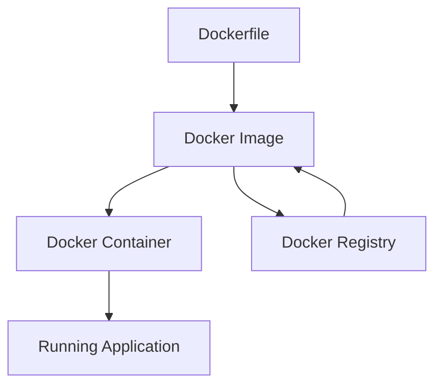

# Docker Guide

Comprehensive guide to containerization with Docker for DevOps workflows.

## Introduction

Docker is a containerization platform that packages applications and their dependencies into lightweight, portable containers.

### Why Docker?

-   **Consistency** - "Works on my machine" becomes "works everywhere"
-   **Isolation** - Applications run in isolated environments
-   **Scalability** - Easy horizontal scaling
-   **Resource Efficiency** - Lower overhead than VMs

## Docker Fundamentals

### Core Concepts



### Basic Commands

```bash
# Image operations
docker build -t myapp:latest .
docker pull nginx:alpine
docker push myregistry/myapp:v1.0

# Container operations
docker run -d -p 8080:80 nginx:alpine
docker ps
docker stop <container-id>
docker logs <container-id>

# Cleanup
docker system prune -f
```

## Dockerfile Best Practices

### Multi-Stage Build Example

```dockerfile title="Dockerfile"
# Build stage
FROM node:18-alpine AS builder
WORKDIR /app
COPY package*.json ./
RUN npm ci --only=production

# Runtime stage
FROM node:18-alpine AS runtime
WORKDIR /app

# Create non-root user
RUN addgroup -g 1001 -S nodejs && \
    adduser -S nextjs -u 1001

# Copy from builder stage
COPY --from=builder /app/node_modules ./node_modules
COPY --chown=nextjs:nodejs . .

# Security: run as non-root
USER nextjs

EXPOSE 3000
HEALTHCHECK --interval=30s --timeout=3s --start-period=5s --retries=3 \
  CMD curl -f http://localhost:3000/health || exit 1

CMD ["npm", "start"]
```

### Python Application Example

```dockerfile title="Dockerfile.python"
FROM python:3.11-slim

# Install system dependencies
RUN apt-get update && apt-get install -y \
    gcc \
    && rm -rf /var/lib/apt/lists/*

# Set working directory
WORKDIR /app

# Install Python dependencies
COPY requirements.txt .
RUN pip install --no-cache-dir -r requirements.txt

# Copy application code
COPY . .

# Create non-root user
RUN useradd --create-home --shell /bin/bash app
USER app

# Expose port
EXPOSE 8000

# Health check
HEALTHCHECK --interval=30s --timeout=10s --start-period=5s --retries=3 \
  CMD python -c "import requests; requests.get('http://localhost:8000/health')"

# Run application
CMD ["gunicorn", "--bind", "0.0.0.0:8000", "app:app"]
```

## Docker Compose

### Development Environment

```yaml title="docker-compose.yml"
version: "3.8"

services:
    web:
        build:
            context: .
            dockerfile: Dockerfile
        ports:
            - "3000:3000"
        environment:
            - NODE_ENV=development
            - DATABASE_URL=postgresql://user:password@db:5432/myapp
        volumes:
            - .:/app
            - /app/node_modules
        depends_on:
            - db
            - redis
        networks:
            - app-network

    db:
        image: postgres:15-alpine
        environment:
            POSTGRES_DB: myapp
            POSTGRES_USER: user
            POSTGRES_PASSWORD: password
        volumes:
            - postgres_data:/var/lib/postgresql/data
            - ./init.sql:/docker-entrypoint-initdb.d/init.sql
        networks:
            - app-network

    redis:
        image: redis:7-alpine
        command: redis-server --appendonly yes
        volumes:
            - redis_data:/data
        networks:
            - app-network

    nginx:
        image: nginx:alpine
        ports:
            - "80:80"
        volumes:
            - ./nginx.conf:/etc/nginx/nginx.conf
        depends_on:
            - web
        networks:
            - app-network

volumes:
    postgres_data:
    redis_data:

networks:
    app-network:
        driver: bridge
```

### Production Environment

```yaml title="docker-compose.prod.yml"
version: "3.8"

services:
    web:
        image: myregistry/myapp:${TAG:-latest}
        restart: unless-stopped
        environment:
            - NODE_ENV=production
            - DATABASE_URL=${DATABASE_URL}
            - REDIS_URL=${REDIS_URL}
        labels:
            - "traefik.enable=true"
            - "traefik.http.routers.web.rule=Host(`myapp.com`)"
            - "traefik.http.routers.web.tls.certresolver=letsencrypt"
        networks:
            - traefik-network
            - internal

    traefik:
        image: traefik:v3.0
        command:
            - "--api.dashboard=true"
            - "--providers.docker=true"
            - "--entrypoints.web.address=:80"
            - "--entrypoints.websecure.address=:443"
            - "--certificatesresolvers.letsencrypt.acme.tlschallenge=true"
            - "--certificatesresolvers.letsencrypt.acme.email=admin@myapp.com"
            - "--certificatesresolvers.letsencrypt.acme.storage=/letsencrypt/acme.json"
        ports:
            - "80:80"
            - "443:443"
        volumes:
            - "/var/run/docker.sock:/var/run/docker.sock:ro"
            - "./letsencrypt:/letsencrypt"
        networks:
            - traefik-network

networks:
    traefik-network:
        external: true
    internal:
        internal: true
```

## Security Best Practices

### Image Security

```dockerfile title="Secure Dockerfile"
# Use specific version tags
FROM node:18.17.0-alpine3.18

# Update packages and remove cache
RUN apk update && apk upgrade && \
    apk add --no-cache dumb-init && \
    rm -rf /var/cache/apk/*

# Create non-root user early
RUN addgroup -g 1001 -S nodejs && \
    adduser -S nextjs -u 1001 -G nodejs

# Set working directory with proper ownership
WORKDIR /app
RUN chown nextjs:nodejs /app

# Copy and install dependencies as root
COPY package*.json ./
RUN npm ci --only=production && \
    npm cache clean --force

# Copy application files with proper ownership
COPY --chown=nextjs:nodejs . .

# Switch to non-root user
USER nextjs

# Use dumb-init as PID 1
ENTRYPOINT ["dumb-init", "--"]
CMD ["npm", "start"]
```

### Security Scanning

```bash
# Scan for vulnerabilities
docker run --rm -v /var/run/docker.sock:/var/run/docker.sock \
  aquasec/trivy image myapp:latest

# Check for secrets
docker run --rm -v $(pwd):/app \
  trufflesecurity/trufflehog filesystem /app

# Lint Dockerfile
docker run --rm -i hadolint/hadolint < Dockerfile
```

## Container Orchestration

### Docker Swarm

```bash
# Initialize swarm
docker swarm init

# Deploy stack
docker stack deploy -c docker-compose.yml myapp

# Scale service
docker service scale myapp_web=3

# Update service
docker service update --image myapp:v2 myapp_web
```

### Kubernetes Deployment

```yaml title="k8s-deployment.yaml"
apiVersion: apps/v1
kind: Deployment
metadata:
    name: myapp
spec:
    replicas: 3
    selector:
        matchLabels:
            app: myapp
    template:
        metadata:
            labels:
                app: myapp
        spec:
            containers:
                - name: myapp
                  image: myregistry/myapp:latest
                  ports:
                      - containerPort: 3000
                  env:
                      - name: NODE_ENV
                        value: "production"
                  resources:
                      requests:
                          memory: "128Mi"
                          cpu: "100m"
                      limits:
                          memory: "256Mi"
                          cpu: "200m"
                  livenessProbe:
                      httpGet:
                          path: /health
                          port: 3000
                      initialDelaySeconds: 30
                      periodSeconds: 10
                  readinessProbe:
                      httpGet:
                          path: /ready
                          port: 3000
                      initialDelaySeconds: 5
                      periodSeconds: 5
```

## Monitoring & Logging

### Container Metrics

```bash
# Real-time stats
docker stats

# Resource usage
docker system df

# Container logs
docker logs -f --tail 100 <container-id>
```

### Prometheus Monitoring

```yaml title="docker-compose.monitoring.yml"
version: "3.8"

services:
    prometheus:
        image: prom/prometheus:latest
        ports:
            - "9090:9090"
        volumes:
            - ./prometheus.yml:/etc/prometheus/prometheus.yml
            - prometheus_data:/prometheus
        command:
            - "--config.file=/etc/prometheus/prometheus.yml"
            - "--storage.tsdb.path=/prometheus"
            - "--web.console.libraries=/etc/prometheus/console_libraries"
            - "--web.console.templates=/etc/prometheus/consoles"

    grafana:
        image: grafana/grafana:latest
        ports:
            - "3001:3000"
        environment:
            - GF_SECURITY_ADMIN_PASSWORD=admin
        volumes:
            - grafana_data:/var/lib/grafana

    cadvisor:
        image: gcr.io/cadvisor/cadvisor:latest
        ports:
            - "8080:8080"
        volumes:
            - /:/rootfs:ro
            - /var/run:/var/run:rw
            - /sys:/sys:ro
            - /var/lib/docker/:/var/lib/docker:ro

volumes:
    prometheus_data:
    grafana_data:
```

## Performance Optimization

### Image Size Optimization

```dockerfile title="Optimized Dockerfile"
# Use multi-stage builds
FROM node:18-alpine AS deps
WORKDIR /app
COPY package*.json ./
RUN npm ci --only=production

FROM node:18-alpine AS runner
WORKDIR /app

# Copy only necessary files
COPY --from=deps /app/node_modules ./node_modules
COPY . .

# Remove development files
RUN rm -rf .git .gitignore README.md docs/

# Use .dockerignore to exclude files
```

```title=".dockerignore"
node_modules
npm-debug.log
.git
.gitignore
README.md
.env
.nyc_output
coverage
.coverage
.pytest_cache
__pycache__
```

### Build Cache Optimization

```bash
# Use BuildKit for better caching
export DOCKER_BUILDKIT=1
docker build --target production -t myapp:latest .

# Multi-platform builds
docker buildx build --platform linux/amd64,linux/arm64 -t myapp:latest --push .
```

## Troubleshooting

### Common Issues

!!! bug "Container Won't Start"
```bash # Check logs
docker logs <container-id>

    # Debug with shell
    docker run -it --entrypoint=/bin/sh <image>

    # Check resource constraints
    docker inspect <container-id>
    ```

!!! bug "Network Issues"
```bash # List networks
docker network ls

    # Inspect network
    docker network inspect <network-name>

    # Test connectivity
    docker exec -it <container> ping <target>
    ```

!!! bug "Volume Mount Problems"
```bash # Check mount points
docker inspect <container-id> | grep Mounts -A 20

    # Verify permissions
    ls -la /host/path
    ```

### Performance Issues

```bash
# Monitor resource usage
docker stats --no-stream

# Check disk usage
docker system df

# Cleanup unused resources
docker system prune -a --volumes
```

For more Docker patterns and examples, see our [container registry](https://github.com/your-org/docker-templates).
